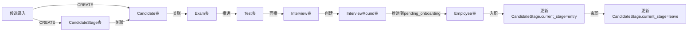

# 招聘管理系统业务规则
> 版本: 2.0
> 日期: 2026-05-11

## 一、业务规则

### 1.1 阶段流转规则

#### 1.1.1 阶段顺序
```
候选录入(candidate_entry) → 机考申报(exam_declare) → 机考完成(exam_complete) → 韧测申报(test_declare) → 韧测完成(test_complete) → 推荐面试(recommend_interview) → 资面安排(qualification_interview) → 技术面试一(tech_interview_1) → 技术面试二(tech_interview_2) → 主管面试(manager_interview) → 租用审批(approval) → Offer(offer) → 待入职(pending_onboarding) → 入职(entry) → 离职(leave)
```

#### 1.1.2 推进条件

| 当前阶段 | 下一阶段 | 推进条件 |
|----------|----------|----------|
| candidate_entry | exam_declare | 自动推进 |
| exam_declare | exam_complete | 机考完成日期已填写 |
| exam_complete | test_declare | 自动推进 |
| test_declare | test_complete | 韧测完成日期已填写 |
| test_complete | recommend_interview | 执行面推操作 |
| recommend_interview | qualification_interview | 当前状态不为待筛选(pending_filter) |
| qualification_interview | tech_interview_1 | 资面通过(currentStatus=passed) |
| tech_interview_1 | tech_interview_2 | 技一通过(currentStatus=passed) |
| tech_interview_2 | manager_interview | 技二通过(currentStatus=passed) |
| manager_interview | approval | 主面通过(currentStatus=passed) |
| approval | offer | 审批通过(currentStatus=passed) |
| offer | pending_onboarding | Offer通过且点击推进按钮 |
| pending_onboarding | entry | 在员工管理界面填写入职日期 |
| entry | leave | 填写离职日期、类型、备注 |

### 1.2 面试关联规则

#### 1.2.1 关联关系
- 面试记录与候选人直接关联（1:1），通过 `candidateId` 字段
- 一个候选人只能有一条面试记录（UNIQUE约束）
- 面试记录直接关联业务线，通过 `businessLineId` 字段（可空）

#### 1.2.2 面推规则
- 点击面推按钮直接创建 Interview 和 InterviewRound 记录
- 推荐日期自动设为当天日期
- InterviewRound 初始状态为 'pending_filter'（待筛选）

#### 1.2.3 推进规则
- **不能推进的情况**：
  - 候选人当前阶段为 entry 或 leave
  - 该候选人已有面试记录（UNIQUE约束自动保证）
- **可以推进的情况**：
  - 该候选人没有任何面试记录

#### 1.2.4 业务线编辑权限
- 业务线配置可设置 `canEdit` 字段（JSON数组，存储用户ID列表）
- 面试阶段编辑业务线时，仅对 `canEdit` 列表中的用户显示业务线编辑区块
- 普通用户查看面试记录时不显示业务线编辑区块

#### 1.2.5 面试列表显示
- 面试管理列表新增「入职日期」列，从 Employee 表获取
- 面试管理列表新增「离职日期」列，从 Employee 表获取
- 编辑 Offer 阶段时，若 Employee 表存在对应记录，则显示接受状态和入职日期
- 关联方式统一使用 candidateId

### 1.3 韧测类型规则

#### 1.3.1 已删除
- 韧测类型表（TestType）已删除
- Test 表的 testTypeId 字段已删除
- 韧测记录不再与韧测类型关联

### 1.4 员工自动创建规则

#### 1.4.1 创建时机
当 Offer 阶段的当前状态选择为"接受"（passed）并保存时自动创建

#### 1.4.2 创建内容
- 从 Candidate 表同步基本信息（name, idCard）
- currentStage 设为 'pending_onboarding'
- entryDate 设为 Offer 阶段填写的入职日期
- candidateId 关联到候选人

#### 1.4.3 创建范围
- 根据候选人ID（candidateId）判断是否已存在员工记录
- 如果已存在且状态为 pending_onboarding，则更新入职日期
- 如果已存在且状态为 entry 或 leave，则忽略同步

#### 1.4.4 Offer阶段字段
- 沟通日期（scheduledDate）：必填
- 沟通结果（currentStatus）：待审批、放弃、通过、未通过
- 入职日期（entryDate）：当沟通结果为"通过"时必填

### 1.5 顾问分配规则

#### 1.5.1 顾问字段说明
- `consultantId`：负责该候选人招聘全流程的顾问，存储在 CandidateStage 表中
- 可为主管(manager)或顾问(consultant)角色
- 系统管理员(admin)不参与统计

#### 1.5.2 默认值规则
- 新增候选人时，默认选择当前登录用户

### 1.6 权限控制规则

#### 1.6.1 角色定义
| 角色 | 权限说明 |
|------|----------|
| manager | 系统管理员/主管，拥有全部权限 |
| consultant | 顾问，拥有候选人管理、面试管理等业务权限 |

#### 1.6.2 模块访问控制
- 候选录入管理：所有登录用户
- 机考管理：所有登录用户
- 韧测管理：所有登录用户
- 面试管理：所有登录用户
- 员工管理：所有登录用户
- 用户管理：仅 manager
- 阶段配置：仅 manager

### 1.7 数据验证规则

#### 1.7.1 候选人验证
- 姓名：必填，最大100字符
- 性别：必填（male/female）
- 手机号：必填，格式验证
- 邮箱：必填，格式验证
- 身份证号：必填，格式验证

#### 1.7.2 面试验证
- 推荐面试：推荐日期必填
- 资格面试：日期、面试官、结论必填
- 技术面试：日期、面试官、评价、结论必填
- 主管面试：日期、主考官、评价、结论必填
- 审批：日期、审批人、结论必填
- Offer：日期、审批人、结论必填

## 二、数据流规则

### 2.1 数据流转架构

```
用户操作 → API请求 → 路由处理 → 业务逻辑 → 数据库操作 → 返回响应 → 前端状态更新
```

### 2.2 核心表职责划分

#### 2.2.1 CandidateStage（核心表）
- **职责**：统一管理候选人全生命周期阶段
- **关键字段**：
  - candidateId：关联候选人
  - consultantId：负责顾问
  - currentStage：当前阶段
  - previousStage：上一阶段
  - stageHistory：阶段变更历史（JSON数组）
  - updatedBy：最后更新人

#### 2.2.2 Candidate
- **职责**：仅存储候选人基本信息
- **关键字段**：name, email, phone, gender, idCard

#### 2.2.3 Employee
- **职责**：仅存储员工特有信息（入职/离职相关）
- **个人信息获取**：通过 candidateId 从 Candidate 表获取
- **阶段信息获取**：通过 candidateId 从 CandidateStage 表获取

#### 2.2.4 Interview
- **职责**：仅存储面试记录基本信息
- **阶段信息获取**：通过 candidateId 从 CandidateStage 表获取

### 2.3 候选人数据流转



### 2.4 阶段字段同步规则

#### 2.4.1 单一数据源原则
- **CandidateStage.currentStage** 是所有阶段的唯一数据源
- Candidate、Employee、Interview 表不再存储阶段字段
- 各模块需要阶段信息时，从 CandidateStage 表查询

#### 2.4.2 更新规则
1. 候选人推进阶段时：
   - 仅更新 CandidateStage.currentStage
   - 记录变更到 CandidateStage.stageHistory
   - 设置 CandidateStage.previousStage
   - 更新 CandidateStage.updatedBy

2. 员工管理页面修改阶段时：
   - 仅更新 CandidateStage.currentStage
   - Employee 表不存储阶段信息

3. 员工阶段变更为 entry/leave 时：
   - 更新 CandidateStage.currentStage
   - 同时更新 Employee 表的相关字段（entryDate/leaveDate等）

### 2.5 API 请求流程

#### 2.5.1 创建候选人流程
```
POST /api/candidates
  → 参数验证
  → 检查身份证号唯一性
  → 创建Candidate记录
  → 创建CandidateStage记录（自动关联）
  → 返回创建结果
```

#### 2.5.2 推进阶段流程
```
PUT /api/candidates/:id/advance
  → 验证权限
  → 获取当前阶段（从CandidateStage）
  → 检查推进条件
  → 更新CandidateStage字段
  → 如果推进到pending_onboarding，创建Employee记录
  → 返回结果
```

#### 2.5.3 面推流程
```
POST /api/candidates/:id/push-interview
  → 验证权限
  → 检查面推条件(can-recommend)
  → 创建Interview记录
  → 创建InterviewRound记录(stageCode=recommend_interview, currentStatus=pending_filter)
  → 更新CandidateStage.currentStage
  → 返回结果
```

### 2.6 数据库操作规则

#### 2.6.1 事务处理
- 涉及多表操作时使用事务
- 面试推进操作使用事务
- 员工创建与阶段更新使用事务

#### 2.6.2 外键约束
```sql
Candidate.lastOperatorId → User.id
CandidateStage.candidateId → Candidate.id (UNIQUE)
CandidateStage.consultantId → User.id
CandidateStage.updatedBy → User.id
Interview.candidateId → Candidate.id (UNIQUE)
Interview.businessLineId → BusinessLine.id (可空)
InterviewRound.interviewId → Interview.id
Employee.candidateId → Candidate.id
Employee.businessLineId → BusinessLine.id (可空)
Employee.updatedBy → User.id
```

**说明**：
- CandidateStage.candidateId 有 UNIQUE 约束，一个候选人只有一条阶段记录
- CandidateProductLine 表已删除
- BusinessLine.clientOwner 字段已删除
- TestType 表已删除，Test.testTypeId 字段已删除

#### 2.6.3 命名规范
- 数据库字段：snake_case
- 模型属性：camelCase（通过 underscored: true 映射）

### 2.7 状态同步机制

#### 2.7.1 面试记录状态
```
progressing → passed → failed
         ↖          ↙
           可更新
```

#### 2.7.2 面试轮次状态
| 字段 | 类型 | 说明 |
|------|------|------|
| currentStatus | VARCHAR(50) | 当前状态（pending_filter=待筛选, passed=通过, failed=未通过） |
| scheduledDate | DATE | 安排日期 |
| feedbackDate | DATE | 反馈日期 |
| completedAt | DATE | 完成日期 |

**推荐面试阶段特殊状态**：
- `pending_filter`：待筛选（面推时初始状态）
- `passed`：通过
- `failed`：未通过

**其他阶段状态**：
- `passed`：通过
- `failed`：未通过

#### 2.7.3 阶段变更历史
- CandidateStage.stageHistory 记录所有阶段变更
- 格式：JSON数组，每个元素包含阶段、时间、操作人
- 示例：
```json
[
  {"stage": "candidate_entry", "time": "2026-05-11T10:00:00Z", "operator": 1},
  {"stage": "exam_declare", "time": "2026-05-11T11:00:00Z", "operator": 1}
]
```

## 三、业务异常处理

### 3.1 常见错误场景

| 错误类型 | 触发条件 | 处理方式 |
|----------|----------|----------|
| 重复身份证号 | 创建候选人时身份证号已存在 | 返回400错误 |
| 无法推进 | 不满足推进条件 | 返回400错误及原因 |
| 无法面推 | 存在有效的面试记录 | 返回400错误及原因 |
| 权限不足 | 访问受限资源 | 返回403错误 |
| 资源不存在 | 查询不存在的记录 | 返回404错误 |

### 3.2 异常处理流程

```
API请求 → 参数验证 → 业务验证 → 数据库操作 → 返回响应
              ↓              ↓
        参数错误         业务规则校验失败
              ↓              ↓
         返回400         返回400+错误原因
```

## 四、数据统计规则

### 4.1 统计维度

#### 4.1.1 阶段统计
- **数据源**：CandidateStage 表（而非 Candidate 表）
- 按 CandidateStage.currentStage 分组统计
- 包含所有阶段

#### 4.1.2 顾问统计
- **数据源**：CandidateStage 表（而非 Candidate 表）
- 按 CandidateStage.consultantId 分组统计
- 包含 manager 和 consultant 角色
- 排除 admin 用户

#### 4.1.3 流程效率统计
- 候选录入到机考申报天数
- 机考申报到机考完成天数
- 推荐面试到资面安排天数
- 前置阶段整体天数
- 面试阶段整体天数

### 4.2 统计时间范围
- 默认全部时间
- 支持按日期范围筛选（startDate, endDate）

## 五、配置规则

### 5.1 阶段配置
- 各模块独立配置自己相关的阶段
- 通过 StageConfig 表管理
- 配置格式：JSON数组
- **候选录入模块（candidate_entry）规则**：
  - 仅显示配置中指定的阶段
  - 不再包含配置阶段之后的阶段
  - 列表API支持stages参数传递阶段数组

### 5.2 默认配置（模块化）
```json
{
  "candidate_entry": ["candidate_entry"],
  "exam_management": ["exam_declare", "exam_complete"],
  "test_management": ["test_declare", "test_complete"],
  "interview_management": ["recommend_interview", "qualification_interview", "tech_interview_1", "tech_interview_2", "manager_interview", "approval", "offer", "pending_onboarding"],
  "employee_management": ["pending_onboarding", "entry", "leave"]
}
```

---

**版本**: v2.0  
**生成日期**: 2026-05-11  
**适用系统**: OD-Recruit 招聘管理系统
---

## 版本历史
| 版本 | 日期 | 说明 |
|------|------|------|
| v2.0 | 2026-05-11 | 1. 核心架构重构：新增 CandidateStage 表统一管理阶段<br>2. 简化 Candidate/Employee/Interview 表，移除冗余字段<br>3. 统计数据源从 Candidate 表改为 CandidateStage 表<br>4. 阶段配置模块化：各模块只配置自己相关的阶段<br>5. 单一数据源原则：所有阶段从 CandidateStage 查询 |
| v1.8 | 2026-05-11 | 1. 修复统计报表模块报错：`by-consultant` 和 `summary` 接口将 `consultantId` 字段从 `Candidate` 表改为从 `CandidateStage` 表查询 |
| v1.7 | 2026-05-09 | 1. 员工管理所有阶段变化都会同步到面试表<br>2. 员工和面试关联统一使用 candidateId<br>3. 面试管理列表新增入职日期和离职日期列，从 Employee 表获取<br>4. 修复编辑 Offer 阶段时显示接受状态和入职日期<br>5. 修复员工管理编辑保存时入职日期丢失问题 |
| v1.5 | 2026-05-08 | 1. **删除CandidateProductLine表**，简化数据模型<br>2. Interview表新增businessLineId字段，直接关联产品线<br>3. InterviewRound表：passed改为currentStatus，新增feedbackDate字段<br>4. 推荐面试阶段状态：待筛选(pending_filter)/通过(passed)/未通过(failed)<br>5. 面推流程简化：直接创建Interview和InterviewRound记录，推荐日期设为当天<br>6. 推进条件更新：推荐面试需当前状态不为待筛选 |
