# 招聘管理系统 - 业务规则与数据流规则

## 一、业务规则

### 1.1 阶段流转规则

#### 1.1.1 阶段顺序
```
候选录入(candidate_entry) → 机考申报(exam_declare) → 机考完成(exam_complete) → 韧测申报(test_declare) → 韧测完成(test_complete) → 推荐面试(recommend_interview) → 资面安排(qualification_interview) → 技术面试一(tech_interview_1) → 技术面试二(tech_interview_2) → 主管面试(manager_interview) → 租用审批(approval) → Offer(offer) → 待入职(pending_onboarding) → 入职(entry) → 离职(leave)
```

#### 1.1.2 推进条件

| 当前阶段 | 下一阶段 | 推进条件 |
|----------|----------|----------|
| candidate_entry | exam_declare | 自动推进 |
| exam_declare | exam_complete | 机考完成日期已填写 |
| exam_complete | test_declare | 自动推进 |
| test_declare | test_complete | 韧测完成日期已填写 |
| test_complete | recommend_interview | 执行面推操作 |
| recommend_interview | qualification_interview | 推荐日期已填写 |
| qualification_interview | tech_interview_1 | 资面通过(passed=true) |
| tech_interview_1 | tech_interview_2 | 技一通过(passed=true) |
| tech_interview_2 | manager_interview | 技二通过(passed=true) |
| manager_interview | approval | 主面通过(passed=true) |
| approval | offer | 审批通过(passed=true) |
| offer | pending_onboarding | Offer通过且点击推进按钮 |
| pending_onboarding | entry | 在员工管理界面填写入职日期 |
| entry | leave | 填写离职日期、类型、备注 |

### 1.2 面推规则

#### 1.2.1 不能面推的情况
- 候选人当前阶段为 entry 或 leave
- 存在状态为 passed 或 pending 的面试记录
- 没有可用的产品线

#### 1.2.2 可以面推的情况
- 没有面试记录（首次面推）
- 所有面试记录都已失败（finalStatus='failed'）

### 1.3 员工自动创建规则

#### 1.3.1 创建时机
当候选人从 offer 阶段推进到 pending_onboarding 阶段时自动创建

#### 1.3.2 创建内容
- 从 Candidate 表同步基本信息（name, email, phone, gender, idCard）
- currentStage 设为 'pending_onboarding'
- productLineId 设为当前推进的产品线
- candidateId 关联到候选人

#### 1.3.3 创建范围
为该候选人的所有产品线创建员工记录

### 1.4 顾问分配规则

#### 1.4.1 顾问字段说明
- `consultantId`：负责该候选人招聘全流程的顾问
- 可为主管(manager)或顾问(consultant)角色
- 系统管理员(admin)不参与统计

#### 1.4.2 默认值规则
- 新增候选人时，默认选择当前登录用户

### 1.5 权限控制规则

#### 1.5.1 角色定义
| 角色 | 权限说明 |
|------|----------|
| manager | 系统管理员/主管，拥有全部权限 |
| consultant | 顾问，拥有候选人管理、面试管理等业务权限 |

#### 1.5.2 模块访问控制
- 候选录入管理：所有登录用户
- 机考管理：所有登录用户
- 韧测管理：所有登录用户
- 面试管理：所有登录用户
- 员工管理：所有登录用户
- 用户管理：仅 manager
- 阶段配置：仅 manager

### 1.6 数据验证规则

#### 1.6.1 候选人验证
- 姓名：必填，最大100字符
- 性别：必填（male/female）
- 手机号：必填，格式验证
- 邮箱：必填，格式验证
- 身份证号：必填，格式验证

#### 1.6.2 面试验证
- 推荐面试：推荐日期必填
- 资格面试：日期、面试官、结论必填
- 技术面试：日期、面试官、评价、结论必填
- 主管面试：日期、主考官、评价、结论必填
- 审批：日期、审批人、结论必填
- Offer：日期、审批人、结论必填

## 二、数据流规则

### 2.1 数据流转架构

```
用户操作 → API请求 → 路由处理 → 业务逻辑 → 数据库操作 → 返回响应 → 前端状态更新
```

### 2.2 候选人数据流转

```mermaid
flowchart LR
    A[候选录入] -->|CREATE| B[Candidate表]
    B -->|关联| C[Exam表]
    C -->|推进| D[Test表]
    D -->|面推| E[CandidateProductLine表]
    E -->|创建| F[Interview表]
    F -->|关联| G[InterviewRound表]
    G -->|推进到pending_onboarding| H[Employee表]
    H -->|入职| I[更新Employee.currentStage=entry]
    I -->|离职| J[更新Employee.currentStage=leave]
```



### 2.3 阶段字段同步规则

#### 2.3.1 阶段字段位置
| 字段 | 表名 | 说明 |
|------|------|------|
| currentStage | Candidate | 候选人全局阶段 |
| currentStage | Employee | 员工阶段 |
| interviewStage | CandidateProductLine | 产品线面试阶段 |
| currentStage | Interview | 面试记录阶段 |

#### 2.3.2 更新规则
1. 候选人推进时，同步更新：
   - Candidate.currentStage
   - CandidateProductLine.interviewStage
   - Interview.currentStage

2. 员工管理页面只修改：
   - Employee.currentStage

3. 员工阶段变更为 entry/leave 时：
   - 同步更新 Candidate.currentStage

### 2.4 API 请求流程

#### 2.4.1 创建候选人流程
```
POST /api/candidates
  → 参数验证
  → 检查身份证号唯一性
  → 创建Candidate记录
  → 返回创建结果
```

#### 2.4.2 推进阶段流程
```
PUT /api/candidates/:id/advance
  → 验证权限
  → 获取当前阶段
  → 检查推进条件
  → 更新阶段字段
  → 如果推进到pending_onboarding，创建Employee记录
  → 返回结果
```

#### 2.4.3 面推流程
```
POST /api/candidates/:id/push-interview
  → 验证权限
  → 检查面推条件(can-recommend)
  → 创建CandidateProductLine记录
  → 创建Interview记录
  → 更新Candidate.currentStage
  → 返回结果
```

### 2.5 数据库操作规则

#### 2.5.1 事务处理
- 涉及多表操作时使用事务
- 面试推进操作使用事务
- 员工创建与阶段更新使用事务

#### 2.5.2 外键约束
```sql
Candidate.lastOperatorId → User.id
Candidate.consultantId → User.id
CandidateProductLine.candidateId → Candidate.id
CandidateProductLine.productLineId → ProductLine.id
Interview.candidateProductLineId → CandidateProductLine.id
InterviewRound.interviewId → Interview.id
Employee.candidateId → Candidate.id
Employee.productLineId → ProductLine.id
```

#### 2.5.3 命名规范
- 数据库字段：snake_case
- 模型属性：camelCase（通过 underscored: true 映射）

### 2.6 状态同步机制

#### 2.6.1 面试记录状态
```
pending → passed → failed
         ↖       ↙
           可更新
```

#### 2.6.2 面试轮次状态
| 字段 | 类型 | 说明 |
|------|------|------|
| passed | BOOLEAN | 是否通过（null=未完成, true=通过, false=未通过） |
| scheduledDate | DATE | 安排日期 |
| completedAt | DATE | 完成日期 |

#### 2.6.3 候选人阶段同步
- 取所有产品线面试阶段的最前进阶段
- 当任一产品线推进到新阶段时更新

## 三、业务异常处理

### 3.1 常见错误场景

| 错误类型 | 触发条件 | 处理方式 |
|----------|----------|----------|
| 重复身份证号 | 创建候选人时身份证号已存在 | 返回400错误 |
| 无法推进 | 不满足推进条件 | 返回400错误及原因 |
| 无法面推 | 存在有效的面试记录 | 返回400错误及原因 |
| 权限不足 | 访问受限资源 | 返回403错误 |
| 资源不存在 | 查询不存在的记录 | 返回404错误 |

### 3.2 异常处理流程

```
API请求 → 参数验证 → 业务验证 → 数据库操作 → 返回响应
              ↓              ↓
        参数错误         业务规则校验失败
              ↓              ↓
         返回400         返回400+错误原因
```

## 四、数据统计规则

### 4.1 统计维度

#### 4.1.1 阶段统计
- 按 Candidate.currentStage 分组统计
- 包含所有阶段

#### 4.1.2 顾问统计
- 按 Candidate.consultantId 分组统计
- 包含 manager 和 consultant 角色
- 排除 admin 用户

#### 4.1.3 流程效率统计
- 候选录入到机考申报天数
- 机考申报到机考完成天数
- 推荐面试到资面安排天数
- 前置阶段整体天数
- 面试阶段整体天数

### 4.2 统计时间范围
- 默认全部时间
- 支持按日期范围筛选（startDate, endDate）

## 五、配置规则

### 5.1 阶段配置
- 各模块可独立配置可见阶段
- 通过 StageConfig 表管理
- 配置格式：JSON数组
- **候选录入模块（candidate_entry）规则**：
  - 仅显示配置中指定的阶段
  - 不再包含配置阶段之后的阶段
  - 列表API支持stages参数传递阶段数组

### 5.2 默认配置
```json
{
  "candidate_entry": ["candidate_entry", "exam_declare", "exam_complete", "test_declare", "test_complete", "recommend_interview", "qualification_interview", "tech_interview_1", "tech_interview_2", "manager_interview", "approval", "offer", "pending_onboarding", "entry", "leave"],
  "exam_management": ["candidate_entry", "exam_declare", "exam_complete", "test_declare", "test_complete", "recommend_interview", "qualification_interview", "tech_interview_1", "tech_interview_2", "manager_interview", "approval", "offer", "pending_onboarding", "entry", "leave"],
  "test_management": ["candidate_entry", "exam_declare", "exam_complete", "test_declare", "test_complete", "recommend_interview", "qualification_interview", "tech_interview_1", "tech_interview_2", "manager_interview", "approval", "offer", "pending_onboarding", "entry", "leave"],
  "interview_management": ["candidate_entry", "exam_declare", "exam_complete", "test_declare", "test_complete", "recommend_interview", "qualification_interview", "tech_interview_1", "tech_interview_2", "manager_interview", "approval", "offer", "pending_onboarding", "entry", "leave"],
  "employee_management": ["pending_onboarding", "entry", "leave"]
}
```

---

**版本**: v1.2  
**生成日期**: 2026-05-05  
**适用系统**: OD-Recruit 招聘管理系统
---

## 版本历史
| 版本 | 日期 | 说明 |
|------|------|------|
| v1.2 | 2026-05-05 | 1. 优化面试管理同步逻辑：当finalStatus为passed时，候选人阶段保持与interview.currentStage一致<br>2. 修改PUT接口逻辑：编辑保存时仅当轮次未通过时设置finalStatus为failed<br>3. 修复前端编辑权限：即使finalStatus为passed，只要是当前阶段就可以编辑<br>4. 统一机考、韧测、候选录入模块的列表获取逻辑和API优化 |
| v1.1 | 2026-05-05 | 更新候选录入模块阶段获取规则：仅配置的阶段，不再包含之后阶段 |
| v1.0 | 2026-05-04 | 初始版本 |
